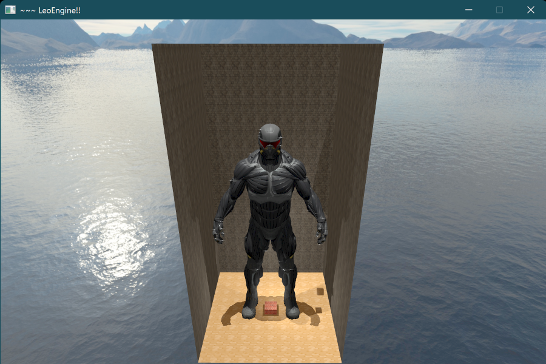
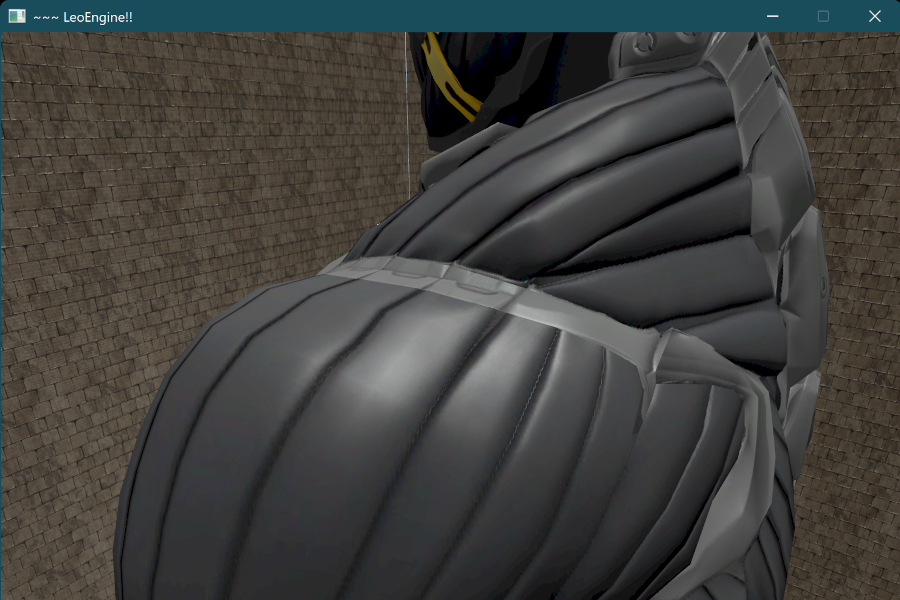
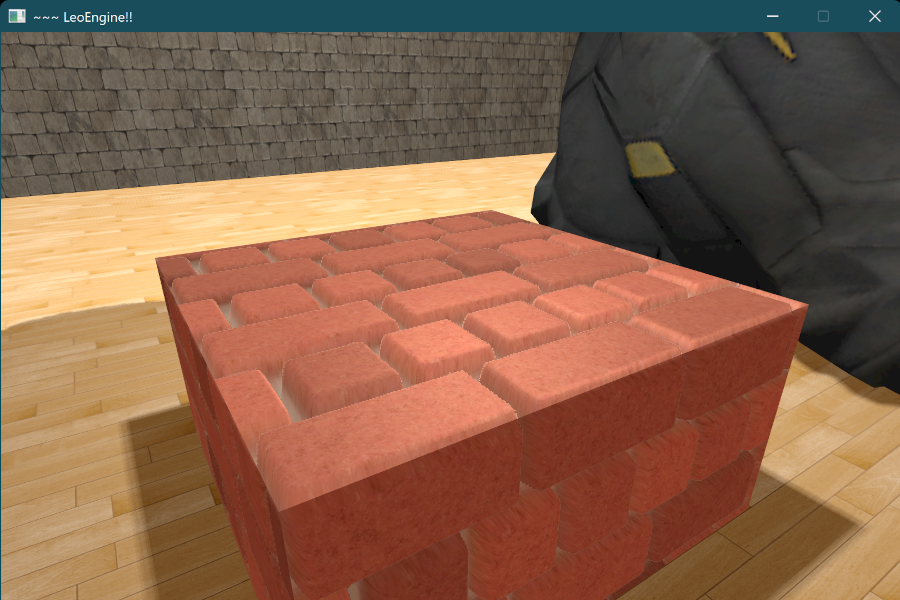
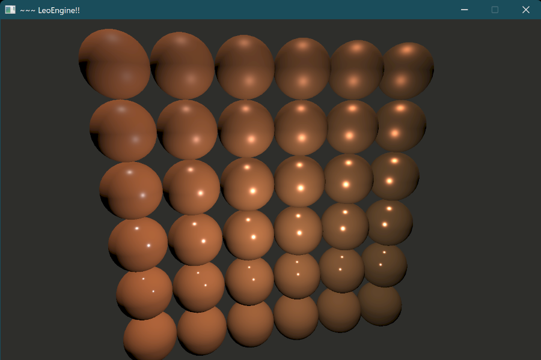
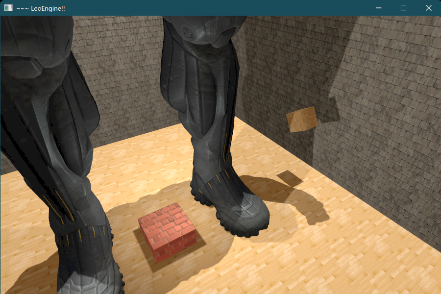
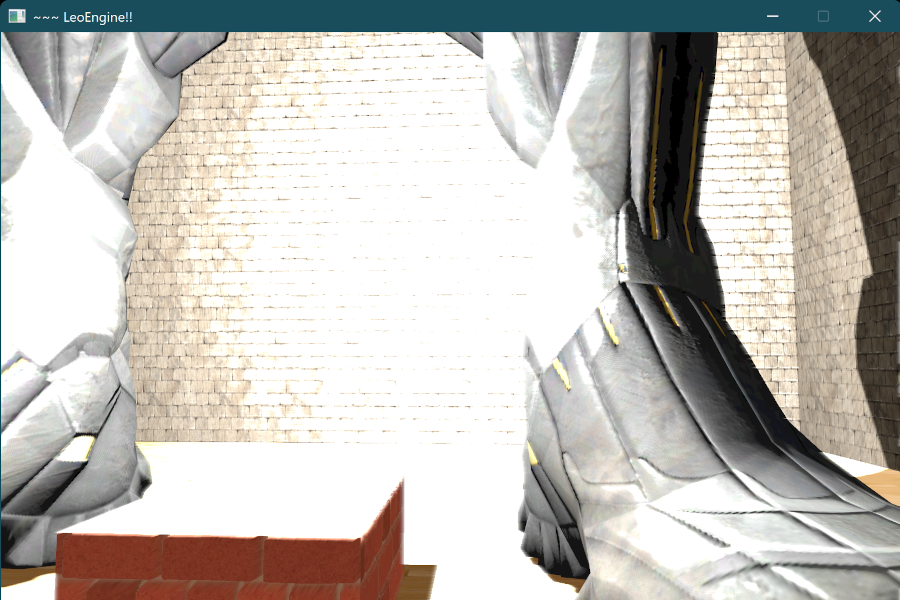
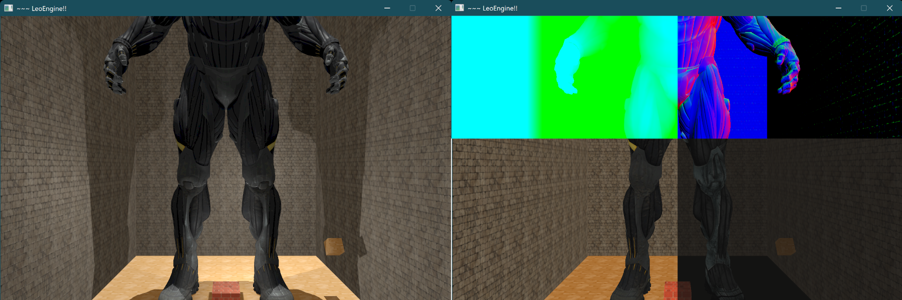

LeoOpenGL
=========

Description
-----------

A playground project I used to explore computer graphics with OpenGL. I had fun with it for about 8 months while working at my first computer-graphics-related job.
It features several fundamental real-time rendering techniques, most of them enabled, but some of them (SSAO, instancing) you have to dig a bit into the code to enable.
* Normal/parallax mapping
* Shadows (from directional and point lights, using shadow maps)
* Post-processing (tone mapping, bloom)
* Deferred shading

Disabled/work-in-progress features include:
* SSAO
* PBR lighting
* Normals in the G-buffer seem to have an incorrect orientation

I do not plan to clean up this project anytime soon, as it was mostly used for self-teaching at a time I did not know much about computer graphics. It is, however, quite a big project, with a fairly complex scene graph, some game programming patterns, OpenGL helpers, and even a homemade "Vulkan-like" (big quotes) render graph that computes the order of subpasses based on inputs and outputs.  It should be fairly easy to build and run if you want to take a look, and you don't mind the mess :)

Gallery
-------

|  |
| :-----------------------------------------------: |
|                  The full scene                   |

|  |
| :---------------------------------------------------------: |
|                       Normal mapping                        |

|  |
| :---------------------------------------------------------------: |
|                         Parallax mapping                          |

|  |
| :--------------------------------------------------------------------------------------: |
|                 Some advanced roughness/metallness material and lighting                 |

|  |
| :-----------------------------------------------------------------------------: |
|                          Point and directional shadows                          |

|  |
| :---------------------------------------------------------------------------------: |
|               Bloom on the edge of the leg and on the top of the cube               |

|             |
| :------------------------------------------------: |
| GBuffer (position, normals, diffuse and specular). |

